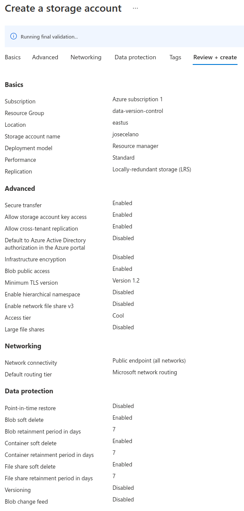
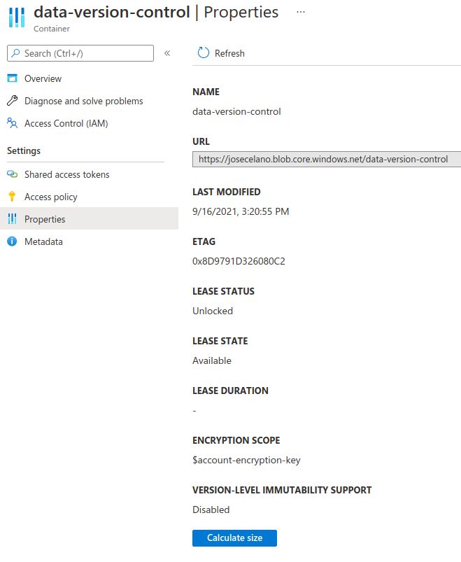
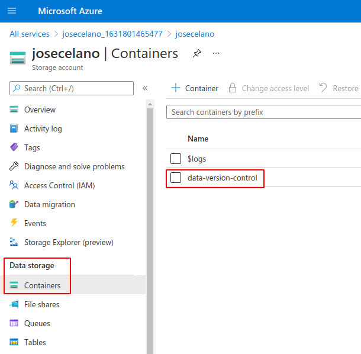
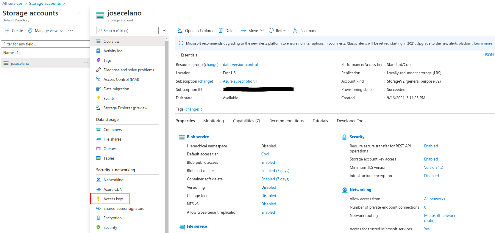
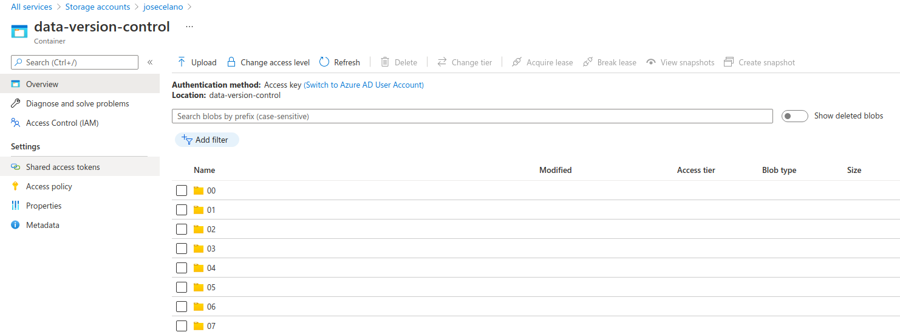

## Add remote storage: Microsoft Azure Blob Storage

I'm using a local remote storage in this repo `.dvc/config`:

```
[core]
    remote = azure
['remote "remote_storage"']
    url = /home/josecelano/Documents/dvc_remote
```
File: https://github.com/josecelano/data-version-control/blob/master/.dvc/config

And I wanted to try Azure Blob Storage. Althougth the DVC documentation is very good it took me 1 hour to set up the Azure container account and container.
I decided to use an account token as authentication method becuase I want to do the same for automatic tasks on GitHub Actions. In fact, I think for that purpuse It's going to be even better to use a "shared access token".

These are the steps:

1. Create the Microsoft Azure Storage Account

The first thing you have to do is create the [storage account](https://docs.microsoft.com/en-us/azure/storage/common/storage-account-overview).

You can check the [official documentation to create an Storage Account](https://docs.microsoft.com/en-us/azure/storage/common/storage-account-create?tabs=azure-portal).

I did not have any problem with this step. There are a couple of things that I really didn't know whether I need them or not but I suppose I can change it later. My final configuration was:



2. Create the container

This is a pretty straightforward step. Official docs [here](https://docs.microsoft.com/en-us/azure/storage/blobs/storage-quickstart-blobs-portal#create-a-container).

I created a container called `data-version-control` for this repo dataset. The container properties are:



After creating the container you have it on the container list:



3. Add the new DVC remote storage

I decided to use an storage account and storage key. And this is what I executed:

```
export AZURE_STORAGE_ACCOUNT='josecelano'
export AZURE_STORAGE_KEY='TEX_YOUR_STORAGE_KEY_=='
dvc remote add -d azure azure://josecelano/data-version-control
```

I used the env vars becuase I'm planning to use it in a pipeline automatic action. So I will probably inject those values as GitHub Actions secrets.

You can get the Access keys from the menu option: Security - networking -> Access Keys:



After executing the `dvc remote add ...` command you should see something like:

```
(dvc) josecelano@josecelano:~/Documents/github/josecelano/data-version-control$ dvc remote add -d azure azure://josecelano/data-version-control
Setting 'azure' as a default remote.
```

The final remote configuration in the dcv config file looks like:

```
[core]
    remote = azure
['remote "remote_storage"']
    url = /home/josecelano/Documents/dvc_remote
['remote "azure"']
    url = azure://data-version-control
```

The url is simply the container name: `azure://CONTAINER_NAME`

3. Push images to the new remote storage

I tried to push all the images to the new remote with `dvc push` but I got this error:

```
(dvc) josecelano@josecelano:~/Documents/github/josecelano/data-version-control$ dvc push
ERROR: failed to push data to the cloud - URL 'azure://' is supported but requires these missing dependencies: ['adlfs', 'knack', 'azure-identity']. To install dvc with those dependencies, run:

	conda install -c conda-forge dvc-azure

See <https://dvc.org/doc/install> for more info.
```

I just followed the instructions to install those dependencies. Finally I retry the push and It worked. All the images were uploaded in a couple of minutes and I can list them from the Azure dashboard:



Unfortunately you can not see the images from Azure dashboard becuase DVC does not use the extension of the file.

The oddificial DVC documentaion for adding remote storages is [here](https://dvc.org/doc/command-reference/remote/add#supported-storage-types).


