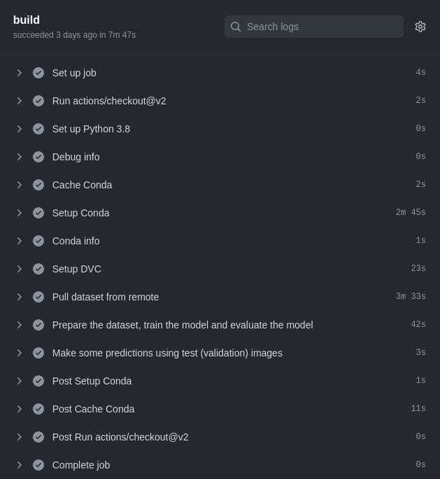

## Basic workflow with DVC

We've implemented a basic workflow using DVC. It's a very simple workflow. We only wanted to do exactly the same things we do when we run the project locally.

At the end of this article you can see the the final workflow version but let's explain all the steps.

1. Setup Python environment with conda

You can build two types of GitHub Actions using Javascript or docker. We are not using docker for the project, we are using [conda]((https://docs.conda.io/)) which is an open source package management system and environment management system for Python. Than means you can create Python environments and install your app dependencies. We had some doubts regarding this approach becuase installing the dependencies takes some minutes but we decided to try it for two reasons:

* This project do not have to many dependencies.
* We can try to use GitHub cache service to avoid installing dependencies again if they have not changed.

The full installation takes 2m 45s.

Actually we have two kind of Python dependencies:

* Our app dependencies: scikit-learn, scikit-image, pandas, numpy
* DVC client dependencies: dvc-azure

The first ones are our app dependencies. The second one is a Python package we need for the DVC client because we are using [Azure Blob Storage](https://azure.microsoft.com/en-us/services/storage/blobs/#overview). The package is [`dvc-azure`](https://anaconda.org/conda-forge/dvc-azure) and it is available on the [conda-forge](https://conda-forge.org/) channel.

For the time being we are going to create a single Python environment for the applicaiton and DVC client because that makes easier to run commands without switching between environemnts but we could need to create two in the feature to know which dependencies have each application.

The conda environment file looks like:

```yml
name: dvc
channels:
  - conda-forge
dependencies:
  - python=3.8
  - scikit-learn
  - scikit-image
  - pandas
  - numpy
  - dvc-azure
```

We are using a GitHub Action for the [conda installation](https://github.com/marketplace/actions/setup-miniconda) step:


```yml
- name: Setup Conda
  uses: conda-incubator/setup-miniconda@v2
  with:
    miniconda-version: "latest"
    auto-update-conda: false
    python-version: '3.8'
    activate-environment: dvc
    environment-file: environment.yml
    use-only-tar-bz2: true # IMPORTANT: This needs to be set for caching to work properly!
```

The documentaion for this step in on the GitHub Action page: https://github.com/marketplace/actions/setup-miniconda

The option `auto-update-conda: false` would be useful if we define a [conda-lock](https://github.com/conda-incubator/conda-lock) file but it's not implemented yet.

Under the hood the action executes this command:

```
conda env update --name dvc --file /home/josecelano/Documents/github/josecelano/data-version-control/setup-miniconda-patched-environment.yml
```

The patched version of the environemnt file is:
```yml
 name: dvc
 channels:
   - conda-forge
 dependencies:
   - python=3.8
   - scikit-learn
   - scikit-image
   - pandas
   - numpy
   - dvc-azure
   - python=3.8
```
We don't know why the action adds a new duplicate line for the Python version.

After installing conda environment we just print debug info with this step:

```yml
- name: Conda info
  run: conda info
```

Output:
```
      active environment : dvc
     active env location : /home/josecelano/Documents/github/josecelano/data-version-control/3/envs/dvc
             shell level : 2
        user config file : /root/.condarc
  populated config files : /root/.condarc
           conda version : 4.10.3
     conda-build version : not installed
          python version : 3.9.5.final.0
        virtual packages : __linux=5.10.0=0
                           __glibc=2.31=0
                           __unix=0=0
                           __archspec=1=x86_64
        base environment : /home/josecelano/Documents/github/josecelano/data-version-control/3  (writable)
       conda av data dir : /home/josecelano/Documents/github/josecelano/data-version-control/3/etc/conda
   conda av metadata url : None
            channel URLs : https://conda.anaconda.org/conda-forge/linux-64
                           https://conda.anaconda.org/conda-forge/noarch
                           https://repo.anaconda.com/pkgs/main/linux-64
                           https://repo.anaconda.com/pkgs/main/noarch
                           https://repo.anaconda.com/pkgs/r/linux-64
                           https://repo.anaconda.com/pkgs/r/noarch
           package cache : /root/conda_pkgs_dir
        envs directories : /home/josecelano/Documents/github/josecelano/data-version-control/3/envs
                           /root/.conda/envs
                platform : linux-64
              user-agent : conda/4.10.3 requests/2.25.1 CPython/3.9.5 Linux/5.10.0-1045-oem ubuntu/20.04.3 glibc/2.31
                 UID:GID : 0:0
              netrc file : None
            offline mode : False
```

2. Setup DVC client

Setting up the DVC client it's an easy task using the offical action.

```yml
- name: Setup DVC
  uses: iterative/setup-dvc@v1
```        

3. Pulling dataset

In order to pull the iamge set we only have to use the `dvc pull` command.
We are using Azure Blob Storage so we need to provide the credentials. We are using an storage account with a key but it would be probably a better idea to use a shared access signature (SAS).

```yml
- name: Pull dataset from remote
  env:
    AZURE_STORAGE_ACCOUNT: ${{ secrets.AZURE_STORAGE_ACCOUNT }}
    AZURE_STORAGE_KEY: ${{ secrets.AZURE_STORAGE_KEY }}
  run: dvc pull --remote azure
```

The remote storage location is in the `./dvc/config` file:

```
['remote "azure"']
    url = azure://data-version-control
```

You have to setup the credentials locally for `act` with the `.env` file int he root folder and with GitHub secrets on th GitHub runner.

Althougth the github runners are hosted on Azure and the remote storage we are using it's also located on Azure, we probably are not using the same region becuase it takes more than 3 minutes to pull the data (~100MB).

4. Conda cache

As suggested but the coda GitHub Action you can enable the cache for conda packages.

```yml
- name: Cache Conda
  uses: actions/cache@v2
  if: ${{ !env.ACT }} # It seems cache doesn't work locally using act. Error: Attempt 1 of 2 failed with error: Cache Service Url not found, unable to restore cache.
  env:
    # Increase this value to reset cache if environment.yml has not changed
    CACHE_NUMBER: 0
  with:
    path: ~/conda_pkgs_dir
    key: ${{ runner.os }}-conda-${{ env.CACHE_NUMBER }}-${{ hashFiles('environment.yml') }}
```

This step basically pulls the packages from GitHub cache. It uses the `environment.yml` file as key for the cache so we only need to get the packages again if we change the dependencies. Internally the Action [sets conda packages directory](https://conda.io/projects/conda/en/latest/user-guide/configuration/use-condarc.html#specify-pkg-directories).

5. Build model

At this point we have the infrastrcuture ready to run our app the same way we run it locally.

```yml
- name: Prepare the dataset, train the model and evaluate the model
  run: |
    python src/prepare.py
    python src/train.py
    python src/evaluate.py
```

6. Use model

Finally we use the model to predict two cases:
```
- name: Make some predictions using test (validation) images
run: |
  python src/predict.py -i data/raw/val/n03888257/n03888257_12212.JPEG # parachute
  python src/predict.py -i data/raw/val/n03445777/n03445777_8541.JPEG  # golf ball
```

It could fail predicting one of the images since the model accuracy is not 100%.

7. Final workflow version

```
name: Build the model

on:
  push:
    branches: [ master ]

jobs:
  build:
    runs-on: ubuntu-latest
    defaults:
      run:
        # To share shell profile between steps
        # https://github.com/marketplace/actions/setup-miniconda#use-a-default-shell
        shell: bash -l {0}

    steps:
      - uses: actions/checkout@v2

      - name: Set up Python 3.8
        uses: actions/setup-python@v2
        with:
          python-version: '3.8'
      - name: Debug info
        run: which python

      - name: Cache Conda
        uses: actions/cache@v2
        if: ${{ !env.ACT }} # It seems cache doesn't work locally using act. Error: Attempt 1 of 2 failed with error: Cache Service Url not found, unable to restore cache.
        env:
          # Increase this value to reset cache if environment.yml has not changed
          CACHE_NUMBER: 0
        with:
          path: ~/conda_pkgs_dir
          key: ${{ runner.os }}-conda-${{ env.CACHE_NUMBER }}-${{ hashFiles('environment.yml') }}

      - name: Setup Conda
        uses: conda-incubator/setup-miniconda@v2
        with:
          miniconda-version: "latest"
          auto-update-conda: false
          python-version: '3.8'
          activate-environment: dvc
          environment-file: environment.yml
          use-only-tar-bz2: true # IMPORTANT: This needs to be set for caching to work properly!
      - name: Conda info
        run: conda info

      - name: Setup DVC
        uses: iterative/setup-dvc@v1

      - name: Pull dataset from remote
        env:
          AZURE_STORAGE_ACCOUNT: ${{ secrets.AZURE_STORAGE_ACCOUNT }}
          AZURE_STORAGE_KEY: ${{ secrets.AZURE_STORAGE_KEY }}
        run: dvc pull --remote azure

      - name: Prepare the dataset, train the model and evaluate the model
        run: |
          python src/prepare.py
          python src/train.py
          python src/evaluate.py

      - name: Make some predictions using test (validation) images
        run: |
          python src/predict.py -i data/raw/val/n03888257/n03888257_12212.JPEG # parachute
          python src/predict.py -i data/raw/val/n03445777/n03445777_8541.JPEG  # golf ball
```

And these are the times for each step:



The two longest setps are "Setup Conda" and "Pull dataset from the remote DVC storage". It takes more than 3 minutes to get the 100 MB images from Azure (East US region) to the runner.

For more ideas about how to improve things see: https://www.youtube.com/channel/UC37rp97Go-xIX3aNFVHhXfQ/playlists
